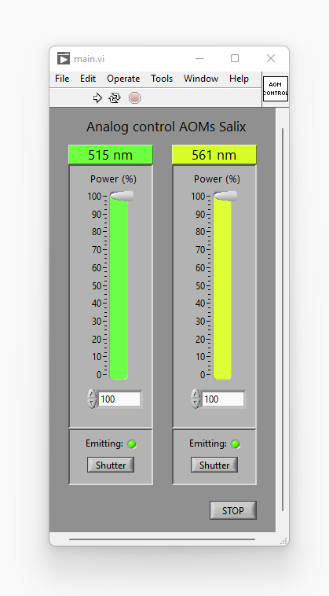

# Salix-AOM-control-powerSupply

This repository contains code for a Labview application for controlling the power of the 515 nm and 561 nm lasers in the C-Flex laser combiner (Hübner photonics) on _Salix_. These two lasers are Diode-Pumped Solid State (DPPS) lasers and should be run at maximum power for optimal performance. Their power can be modulated using acousto-optic modulators (AOM). There are two AOMs in the optical path of these two lasers (one for each laser), inside the C-Flex enclosure. By placing different voltagea over the AOMs, the transmission through the AOM can be set between (nearly) 0% up to 100%.

The Labview application lets the user set a _transmission percentage_ (labeled _Power (%)_ in the gui) for each laser using a slider. This percentage is converted to a voltage value (0-100% is linearly scaled to 0.5V-1.0V). These voltage values are written to the AO0 and AO1 channels (AO0 for 515 nm and AO1 for 561 nm) of a multi-function DAQ device (USB-6002, National Instruments). A lead from each channel (and AO ground) is terminated in a male BNC connector, to connect to the respective AOM controllers. The voltages (0.5V-1.0V DC) are taken from section _6.4 AOM Modulation controls and input signals_ on p.56-57 of the C-Flex owners manual (version DO579-C September 2020).

## Source code structure

The source code of the application (inside the folder _source_) is structured as follows:
* _main.vi_ is the main vi
* the subfolder _source/subvis_ contains the subvi's:
    * _power_to_voltage.vi_: takes in a percentage (from the slider) and convert to a voltage
    * _set_power_to_max.vi_: writes the maximum voltage (1 V DC) to a given DAQ channel. This subvi is used at startup (in _main.vi_) of the application because the C-Flex manual states that "Always start with 1 V DC on the analog modulation input ...".
    * _set_power_to_zero.vi_: writes the minimum voltage (0.5 V DC) to a given DAQ channel. This is used in _main.vi_ when the shutter button in the gui is pressed.
* the files _AOM control gui.lproj_ (project file), _AOM control gui.lproj_  and _AOM control gui.lproj_ are (part of) the project used to build the executable

Any files that are generated when building the .exe file from the project are saved in the folder _builds/AOM control gui_:
* _AOM control gui.exe_: the executable. Double-click to run the application.
* _AOM control gui.aliases_ and _AOM control gui.ini_: files created during building of the .exe file

## User instructions

To use the application, download this repository and double-click on the file _'AOM control gui.exe'_. This will open the gui (see screenshot below). It will automatically start running with transmission set at 100% for both lasers (as recommended by the manufacturer). The power can be adjusted by using the sliders. Each laser line has a _shutter_ button: when pressed, it will set transmission through the AOM to 0%, effectively acting like a shutter. When pressed again, the previous power will be restored. To exit the application, press the stop button at the bottom right corner before closing the window to ensure proper shutdown of the system.

